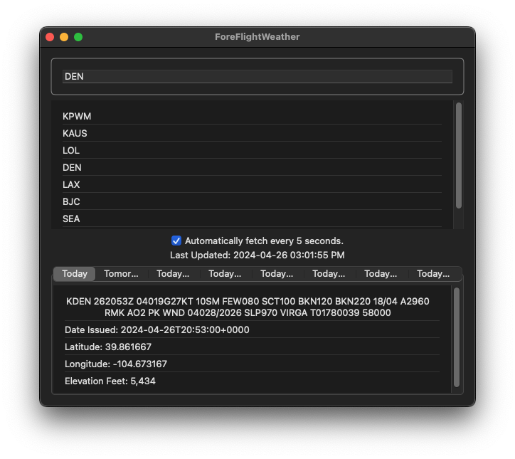

# ForeFlightWeather
An iOS app that fetches and displays the weather report for a given airport from ForeFlight's QA server, this time with up to date SDKs!

## How long was spent on the project
Overall: About 14 hours.
- Started around 9am on April 25th 2024.
- Took at break at 2pm on April 25th to run errands.
- Resumed work at 5pm on April 25th.
- Stopped working for the day at 7pm on April 25th.
- Worked breifly at midnight on April 26th.
- Resumed work around 8:30am on April 26th.
- Finished around 3pm on April 26th.

## Any notable design decisions you wish to highlight
- This project utilizes SwiftUI and SwiftData with the latest SDKs offered publically by Apple as of April 26th 2024.
- This app is cross compilable for macOS.
- All requirements were met, including caching and automatic fetching.
- I tested this app in simulator and on device in various configurations of graphical accessibility and orientation. See below for an example of many accessibility features being enabled. 

## Any references consulted and/or third party libraries used
- TextField: https://developer.apple.com/documentation/swiftui/textfield
- List: https://developer.apple.com/documentation/swiftui/list
- Create dropdown editable TextField: https://stackoverflow.com/questions/73709938/how-to-create-dropdown-with-editable-textfield-in-swiftui
- Simple parsing JSON: https://gist.github.com/kobeumut/b06015646aa0d5f072bfe14e499690ef
- JSON Viewer: https://jsonviewer.stack.hu
- JSON Quicktype: https://app.quicktype.io
- Compiler Warning with ForEach: https://www.hackingwithswift.com/forums/swiftui/compiler-warning-non-constant-range-argument-must-be-an-integer-literal/14878
- Conditional compilation: https://www.swiftbysundell.com/articles/conditional-compilation-within-swift-expressions/
- Preserving your app’s model data across launches: https://developer.apple.com/documentation/swiftdata/preserving-your-apps-model-data-across-launches
- SwiftData Fatal error: failed to find a currently active container: https://forums.developer.apple.com/forums/thread/734212
- Reset iOS Simulator application data to run app for first time: https://stackoverflow.com/questions/16195859/reset-ios-simulator-application-data-to-run-app-for-first-time
- ModelContext: https://developer.apple.com/documentation/swiftdata/modelcontext
- Hashable: https://developer.apple.com/documentation/swift/hashable
- Cannot use mutating member on immutable value of type: https://stackoverflow.com/questions/38764003/cannot-use-mutating-member-on-immutable-value-of-type
- SwiftData struggles. Cannot insert 'MyClass' in this managed object context because it is not found in the associated managed object model: https://stackoverflow.com/questions/77359963/swiftdata-struggles-cannot-insert-myclass-in-this-managed-object-context-beca
- Read-Only properties: https://stackoverflow.com/questions/41273035/read-only-properties
- Toggle: https://developer.apple.com/documentation/swiftui/toggle
- Get Current Date and Time in Swift 5.0: https://medium.com/@gurjindersingh663/get-current-date-and-time-in-swift-5-0-1d1bebdc1981
- How can I make a function execute every second in swift?: https://stackoverflow.com/questions/30090309/how-can-i-make-a-function-execute-every-second-in-swift

## Known issues
- The `weather` array from JSON response of https://qa.foreflight.com/weather/report/ is always empty.
- Auto fetching while in a "More" forecast tab forces the user to an eariler day's forecast upon update.
- It's possible the "Airport Not Found" alert may display the incorrect airport if the user modifies the search text before the network call returns, though I never experienced this issue in my testing.

## Any other notes that will help us understand your project
- This project is my second attempt this time using up-to-date technologies consisting of a 2024 Macbook Pro with iOS 17.4, Xcode 15.3, macOS 14.4, and Swift 5.10.
- The JSON returned from https://qa.foreflight.com/weather/report never contained values for `weather` in my testing. Therefore, I focused the "Details View" on displaying the `text`, `dateIssued`, `lat`, `lon`, and `elevationFt` which was consistently provided.

## Video demo

https://github.com/RetroRebirth/ForeFlightWeather/raw/main/demo.mov
